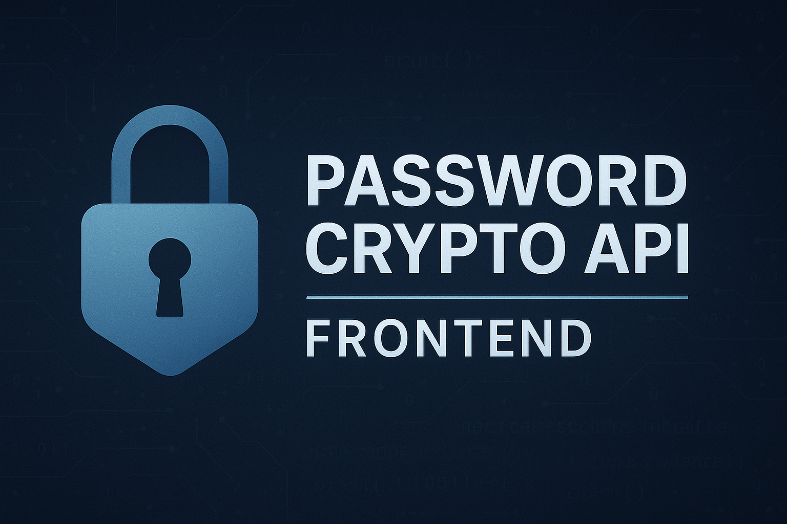
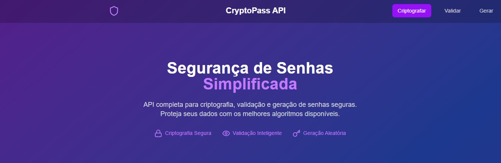
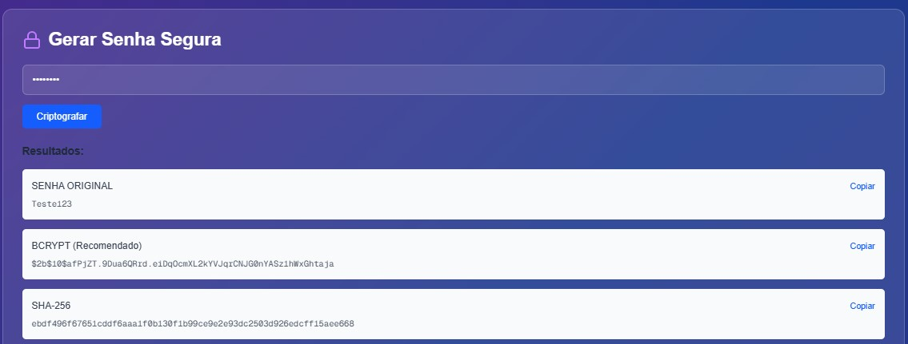
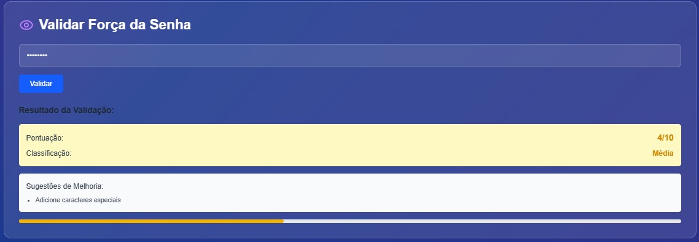
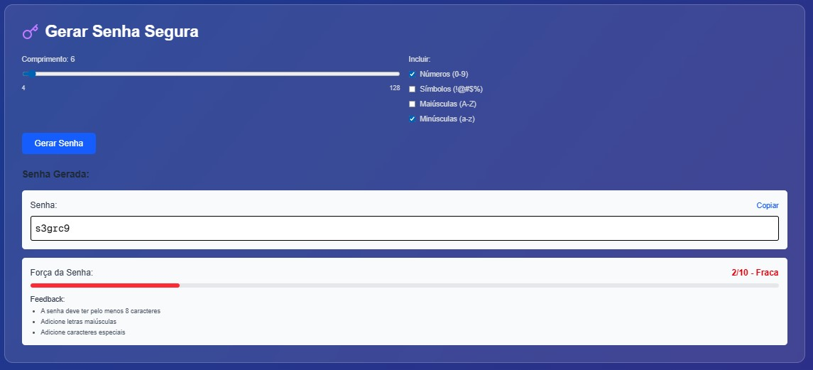

# 🔐 Password Crypto API Frontend



## 📘 Contextualização

A **Password Crypto API UI** é uma aplicação web desenvolvida em **Next.js** com foco na **criptografia, validação e geração de senhas seguras**.

Seu principal objetivo é oferecer uma interface visual simples, moderna e intuitiva para interagir com a [Password Crypto API](https://github.com/mathpestana/password-crypto-api), uma API utilitária que fornece endpoints seguros e rápidos para operações relacionadas a senhas, como hashing com `bcrypt`, verificação de senhas e geração randômica de senhas fortes.

A **Password Crypto API – Frontend** foi desenvolvida como uma interface gráfica intuitiva e responsiva para interagir com a API de segurança de senhas. Essa aplicação facilita o uso dos recursos da API para usuários que desejam:

- Criptografar senhas utilizando diferentes algoritmos
- Avaliar a força de uma senha com feedback
- Gerar senhas aleatórias seguras e personalizadas

Essa interface é ideal para desenvolvedores, entusiastas de segurança ou qualquer usuário final que queira aplicar boas práticas no gerenciamento de senhas.

---

## ⚙️ Tecnologias Utilizadas no Frontend

| Tecnologia           | Descrição                                    |
|----------------------|----------------------------------------------|
| **Next.js**          | Framework React para desenvolvimento web    |
| **React**            | Biblioteca JavaScript para interfaces       |
| **TypeScript**       | Superset tipado do JavaScript               |
| **Tailwind CSS**     | Framework CSS utilitário                    |
| **Node.js**          | Runtime JavaScript                          |
| **ESLint/Prettier**  | Ferramentas de linting e formatação         |

---

## 🚀 Como executar o projeto

### 1. Clone o repositório do frontend

```bash
git clone https://github.com/mathpestana/password-crypto-landing.git

```

### 2. Instale as dependências

```bash
npm install
```

### 3. Execute o projeto em ambiente de desenvolvimento

```bash
npm run dev
```

Acesse a aplicação no navegador em: http://localhost:3000

---

## 🌐 Link para a API utilizada

🔗 **Password Crypto API (Backend):**  
https://github.com/mathpestana/password-crypto-api

A API oferece as seguintes rotas:

- `/api/password/encrypt?password=suaSenha`
- `/api/password/validate?password=suaSenha`
- `/api/password/generate?...`

Mais detalhes estão disponíveis diretamente no repositório da API.

---

## 💻 Funcionalidades da Interface

🔐 **Criptografia de Senhas:** entrada de senha e visualização de hash em diferentes algoritmos.

✅ **Validação de Força:** análise detalhada da qualidade da senha com feedback.

⚙️ **Geração de Senhas:** personalização da senha gerada com controle de tamanho, números, símbolos e letras.

---

## 🖼️ Imagens do Projeto

### ✅ Tela Inicial


### 🔐 Seção de Criptografia


### ✅ Seção de Validação


### ⚙️ Seção de Geração de Senha


---

## 🧑‍💻 Autor

**Matheus Pestana**

GitHub: https://github.com/mathpestana

Projeto educacional desenvolvido para fins de estudo.